# Overlay Flow Diagrams

These diagrams are the visual companion to [Overlay Behavior Reference](overlay-behavior-reference.md). They show the high-level decisions each overlay makes before it renders user-facing content.

They intentionally describe product behavior, not every C# helper. When behavior changes, update the matching written reference and diagram together.

## Shared Visibility Gate

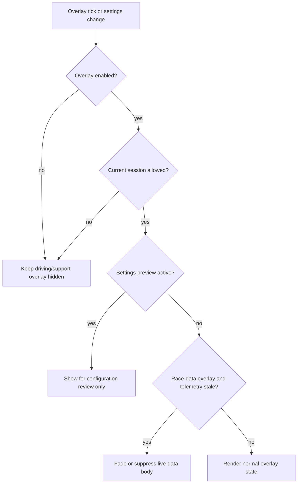

## Settings

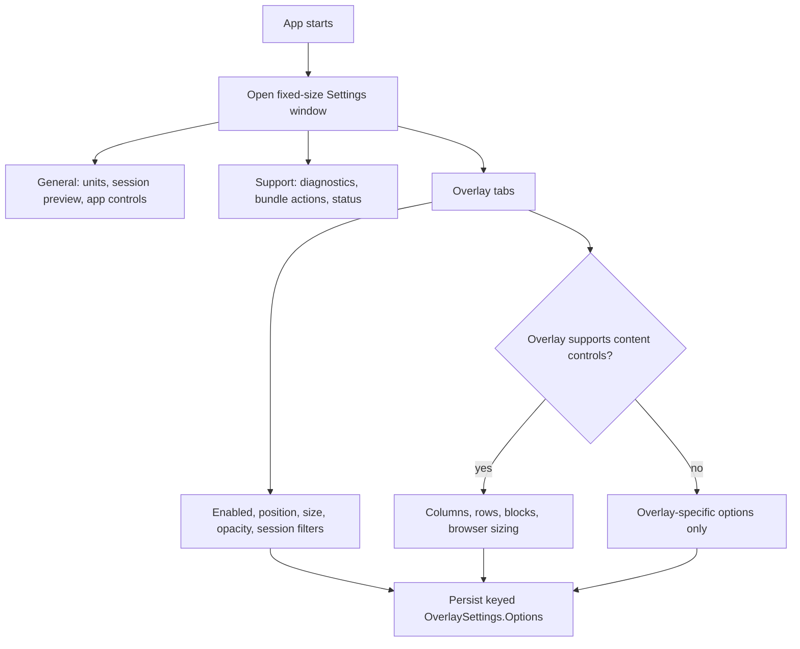

## Standings

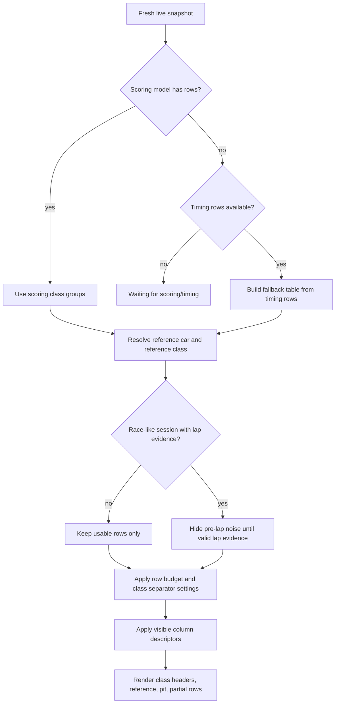

## Relative

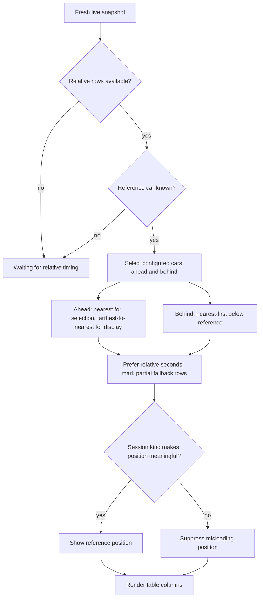

## Fuel Calculator

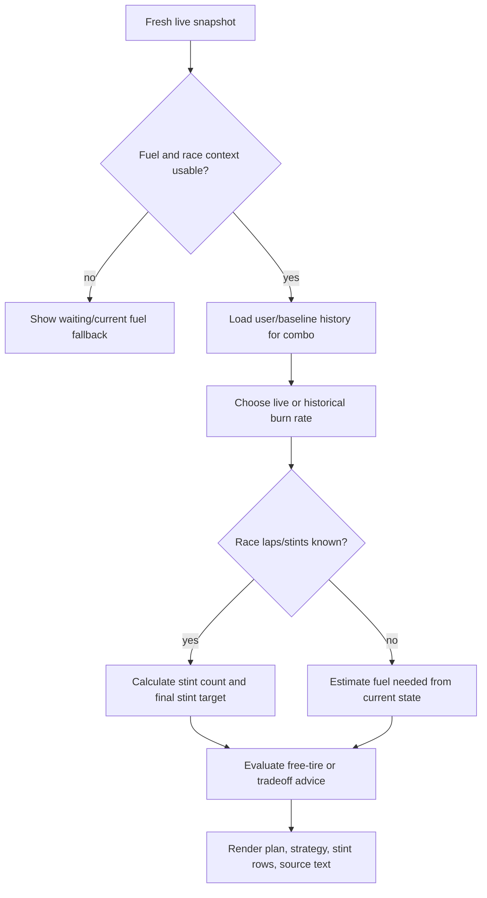

## Track Map

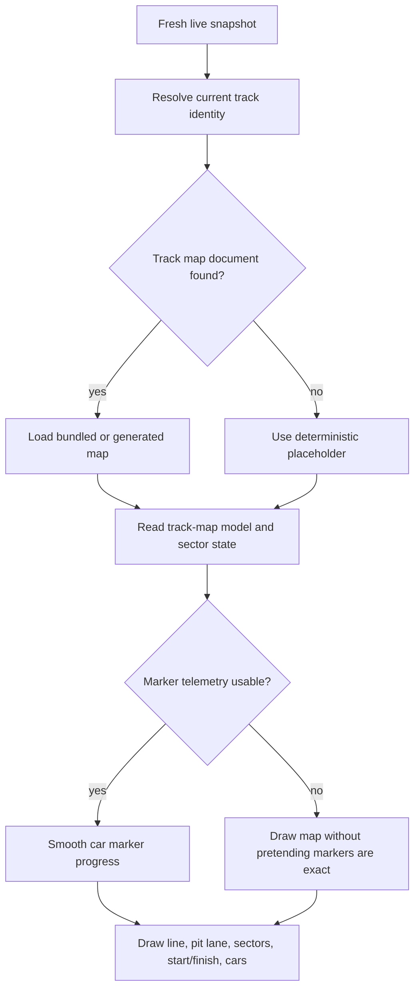

## Stream Chat

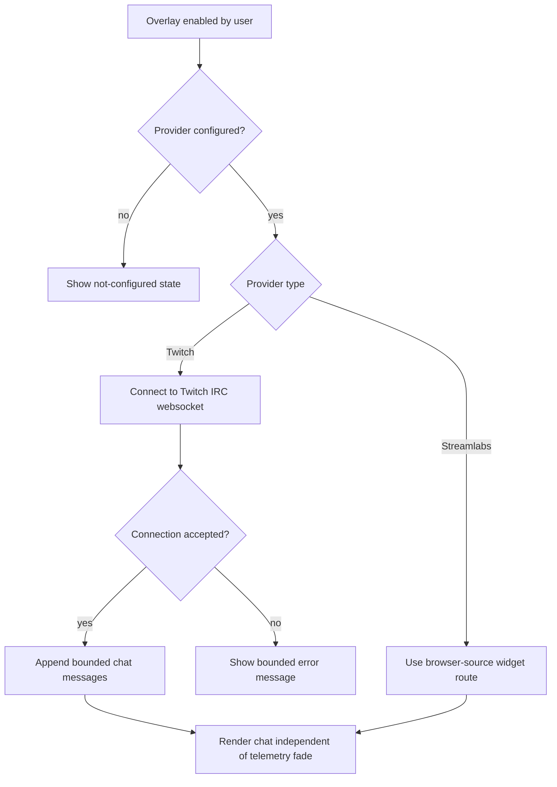

## Garage Cover

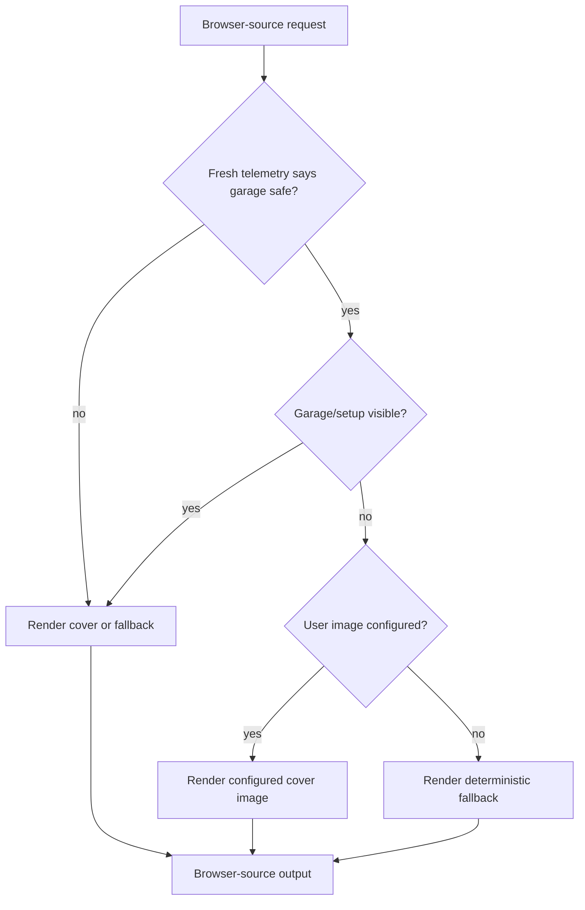

## Flags

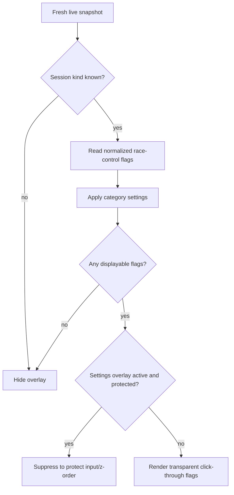

## Session / Weather

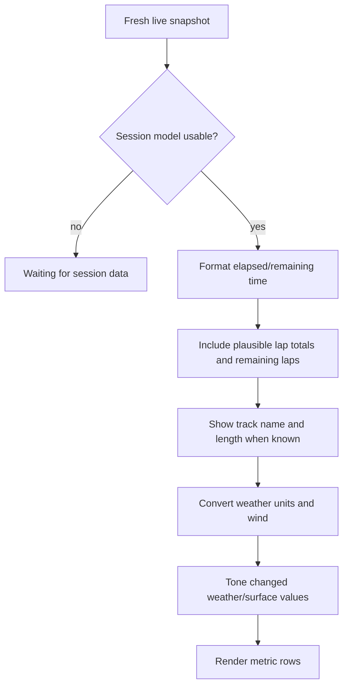

## Pit Service

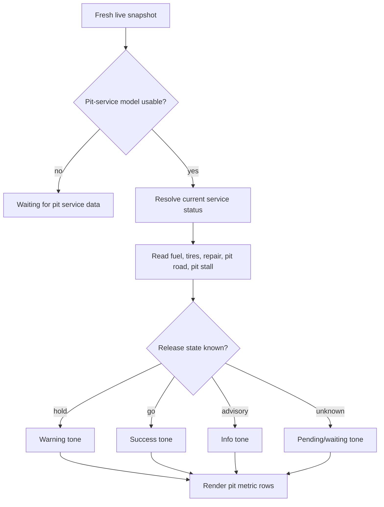

## Input / Car State

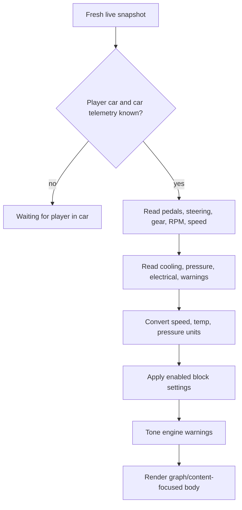

## Car Radar

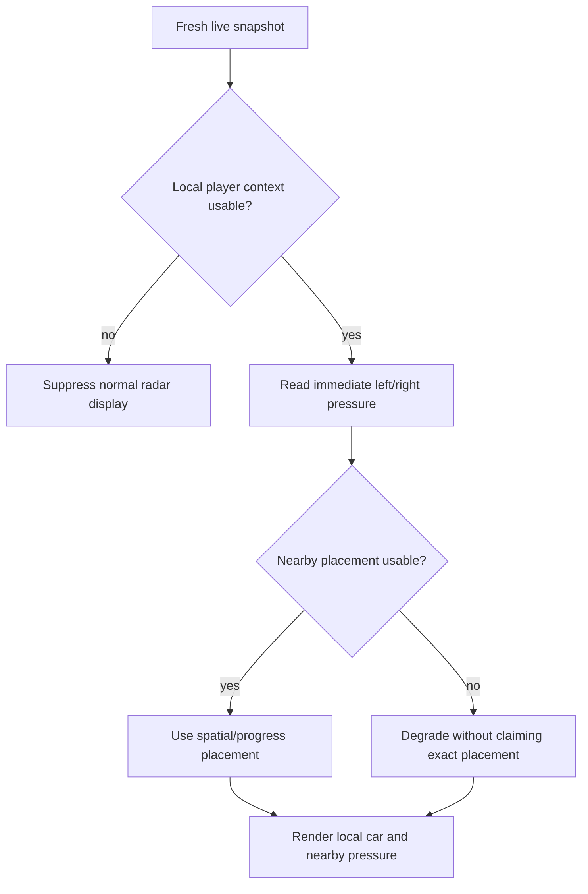

## Gap To Leader

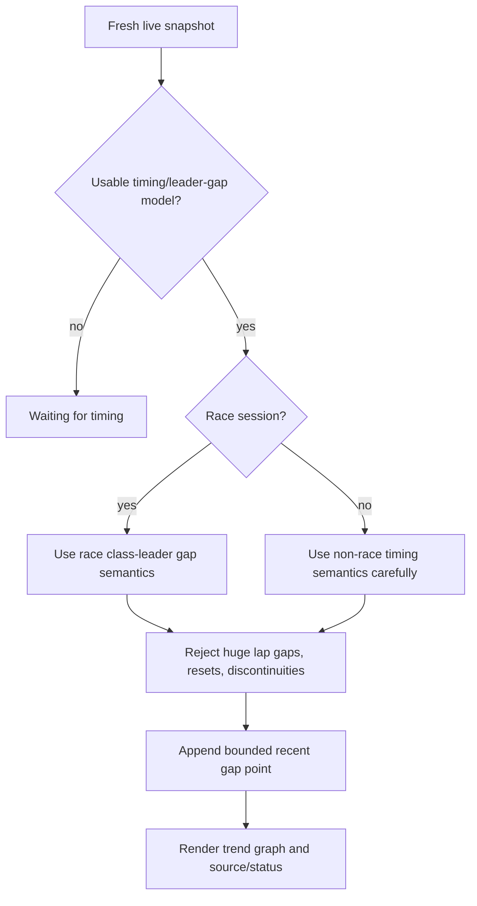

## Status

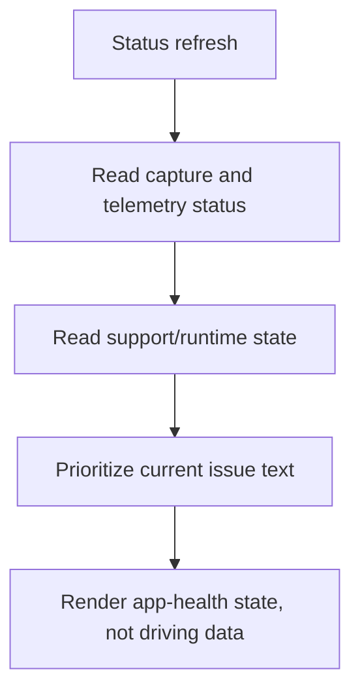

## Browser Review Surface

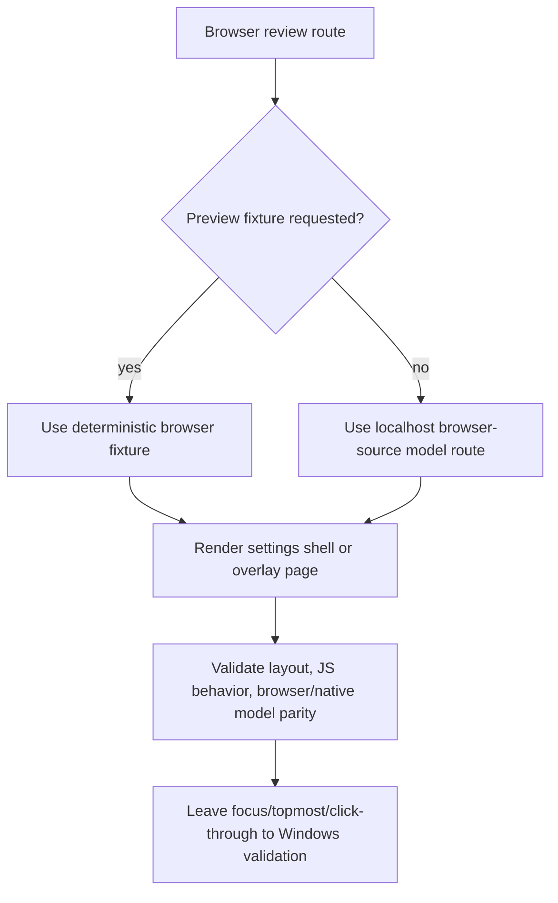
