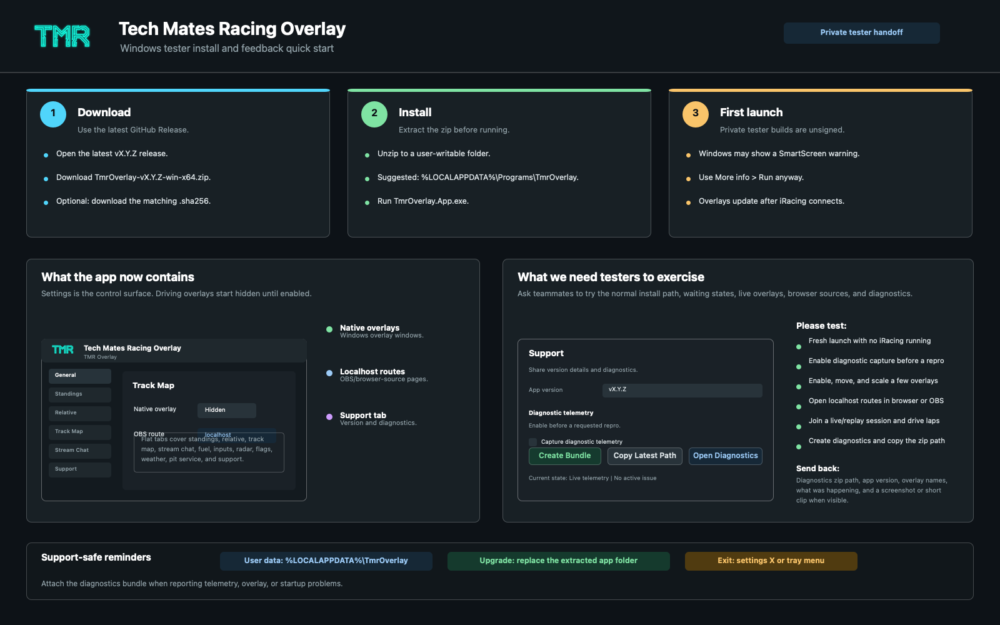

# Windows Releases

TmrOverlay publishes Windows tester builds from GitHub Actions. Starting with the Velopack release-channel branch, a release tag such as `v0.16.1` produces a public GitHub Release with Velopack installer/update assets plus the existing portable zip fallback.

Expected release assets include:

- `TMROverlay-win-x64-Setup.exe`
- a Velopack full `.nupkg` package
- `releases.win-x64.json`
- delta `.nupkg` packages when prior Velopack releases exist
- `TmrOverlay-v<version>-win-x64.zip`
- `TmrOverlay-v<version>-win-x64.zip.sha256`
- `TmrOverlay-v<version>-win-x64-manifest.txt`
- generated GitHub release notes

The Velopack installer and the portable zip are self-contained for Windows x64. Testers do not need to install the .NET runtime.

## One-Page Teammate Guide

The current teammate-facing install/support handoff image is:



Regenerate it after release-package or Support-tab flow changes:

```bash
swift tools/render_release_tutorial.swift
python3 tools/validate_overlay_screenshots.py --profile release-tutorial --root docs/assets
```

## Publishing

1. Merge the release branch to `main` after the Windows validation gate passes.
2. Create an annotated tag on the merge commit:

   ```bash
   git tag -a v0.11.0 -m "v0.11.0 - Track map and localhost overlays" -m "Publishes a portable Windows tester build with standings, track map, and localhost browser overlays."
   git push origin v0.11.0
   ```

3. GitHub Actions runs `.github/workflows/windows-dotnet.yml`.
4. The PR/main validation job restores, builds, tests, validates tracked screenshots, checks Windows screenshot expectations, generates/validates Windows-rendered overlay screenshots as workflow artifacts, runs a self-contained publish dry run with the same package audit used by release packaging, and dry-runs `vpk pack`.
5. The tag workflow publishes `src/TmrOverlay.App` for `win-x64`, audits the publish folder, writes a package manifest, zips the publish folder, generates a SHA-256 checksum, packs Velopack installer/update assets, uploads workflow artifacts, and creates or updates the GitHub Release assets.

Manual workflow dispatch can still produce package artifacts for a branch test run, but it does not create a GitHub Release unless the run is for a `vMAJOR.MINOR.PATCH` tag.

## Package Contents

The portable zip should contain the runtime app only. The release workflow fails if top-level repo/development folders such as `.github`, `captures`, `docs`, `history`, `local-mac`, `mocks`, `skills`, `tests`, or `tools` appear in the publish folder.

The expected package shape is intentionally small:

- `TMROverlay.exe`
- `appsettings.json`
- `Assets/TMRLogo.png`
- optional `Assets/TrackMaps/*.json` bundled derived track maps

The executable icon is embedded from `src/TmrOverlay.App/Assets/TmrOverlay.ico`. The release manifest asset lists the exact published files and sizes for each build, so package review can happen without downloading and unzipping the app.

Velopack package assets are generated from that audited publish folder. The package id is `TMROverlay`, the title is `Tech Mates Racing Overlay`, and the current channel is `win-x64`. The package id intentionally changed from the early `TechMatesRacing.TmrOverlay` tester identity while the app is still pre-1.0 so setup asset names and installed package identity match the shorter executable name.

## Tester Download

1. Open the repository's GitHub Releases page.
2. Open the latest `vMAJOR.MINOR.PATCH` release.
3. Prefer the Velopack setup executable for normal teammate installs and upgrades.
4. Run the setup executable and launch TmrOverlay from the installed shortcut. The installed app executable is `TMROverlay.exe`, but teammates should normally use the shortcut created by setup.
5. Use the portable zip only as a fallback or support artifact. For the zip fallback, download `TmrOverlay-<version>-win-x64.zip` and the matching `.sha256` asset when you want to verify the file.
6. Unzip the portable package into a normal user-writable folder, for example:

   ```text
   %LOCALAPPDATA%\Programs\TmrOverlay
   ```

7. Run `TMROverlay.exe`.

The app stores settings, history, logs, diagnostics bundles, and captures under `%LOCALAPPDATA%\TmrOverlay` by default. Replacing the portable application folder or updating an installed Velopack build does not delete that user data.

## User Data And Compatibility

Installed and portable builds keep user data separate from application binaries by default:

```text
%LOCALAPPDATA%\TmrOverlay
```

That app-data root contains settings, user history, logs, events, diagnostics, runtime state, and optional captures. A new install path or a Velopack-updated app folder should still find the same app-data root unless the user explicitly overrides storage through configuration or `TMR_` environment variables.

Settings are versioned in `settings/settings.json` and loaded through `AppSettingsMigrator`, which normalizes older settings and writes them back at the current settings version. Session history has explicit summary, collection-model, aggregate, and analysis version constants. On startup, `HistoryMaintenanceService` scans user history in the background, backs up and normalizes compatible legacy summaries, skips incompatible/future/corrupt summaries into a maintenance manifest, and rebuilds aggregates. History-backed overlays reject incompatible aggregate versions while maintenance is still running.

If a release changes a durable user-data schema, the branch must update the matching version constants, migrations or compatible readers, schema-compatibility tests, and docs before publishing. For car/track history specifically, changing the stored JSON shape should bump `summaryVersion` and add an ordered summary migration; changing the meaning of a derived metric or confidence rule should bump `collectionModelVersion` and either provide a compatible adapter or intentionally exclude old summaries from current aggregates. Unsupported future or incompatible old history must remain on disk and be excluded from overlays instead of causing startup or parsing failures.

## Checksum Verification

From PowerShell in the folder containing the downloaded zip:

```powershell
$zip = "TmrOverlay-v0.11.0-win-x64.zip"
$expected = (Get-Content "$zip.sha256").Split(" ")[0]
$actual = (Get-FileHash $zip -Algorithm SHA256).Hash.ToLowerInvariant()
$actual -eq $expected
```

The command should print `True`.

## Upgrade And Rollback

Velopack-installed builds check the public GitHub Release feed. The first Velopack pass is intentionally passive: the app can report that an update exists and open the release page, but active download/apply/restart controls are deferred until teammate installer testing proves the channel reliable.

To upgrade a Velopack-installed build:

1. Open TmrOverlay from the tray and use `Check for Updates`, or open the latest GitHub Release directly.
2. If a newer release is available, close TmrOverlay from the settings window or tray menu.
3. Download and run the latest Velopack setup executable from the newer release.
4. Launch TmrOverlay from the installed shortcut.

Because the pre-1.0 package id moved from `TechMatesRacing.TmrOverlay` to `TMROverlay`, installed builds that used the older package id should be treated as a fresh installer transition: close the old app, run the new setup, confirm `%LOCALAPPDATA%\TmrOverlay` settings/history are still present, and uninstall the old tester package if Windows shows both entries.

To move from a portable zip to the Velopack installer:

1. Close the portable copy of TmrOverlay.
2. Run the latest Velopack setup executable.
3. Launch TmrOverlay from the installed shortcut.
4. Keep the old portable folder until the installed app opens correctly, then remove it when no longer needed.

Installed and portable builds both use `%LOCALAPPDATA%\TmrOverlay` by default, so settings, history, logs, diagnostics, runtime state, and captures should carry forward unless the user explicitly overrides storage through configuration or `TMR_` environment variables.

To upgrade a portable release:

1. Exit TmrOverlay from the settings window or tray menu.
2. Keep or rename the old unzipped application folder.
3. Unzip the new release into a fresh folder, or replace the old application files while the app is closed.
4. Start `TMROverlay.exe`.

To roll back a portable release, close the app and run the previous unzipped folder again. To roll back an installed release during tester validation, close TmrOverlay, keep a diagnostics bundle from the problem build, then reinstall the older release setup executable or use that older release's portable zip fallback. User settings/history remain in `%LOCALAPPDATA%\TmrOverlay`; if a future release changes a durable schema, the branch must document migration and compatibility before release.

## Signing And SmartScreen

Current tester builds may remain unsigned until signing is added. Windows SmartScreen or antivirus tools may warn on first launch because the executable or setup package is new and unsigned. Broader distribution should not rely on unsigned builds; choose executable/package signing before publishing beyond private testers.

## Diagnostics For Feedback

For teammate feedback, ask testers to include:

- the release tag they installed
- the app version shown in diagnostics or support output
- a diagnostics bundle from `%LOCALAPPDATA%\TmrOverlay\diagnostics`
- notes about whether iRacing was live, replaying, or not running

Diagnostics bundles include app version/runtime metadata and local logs, but they intentionally exclude raw `telemetry.bin` and source `.ibt` payloads.

Diagnostics bundles also include release update state: whether the app is installed through Velopack, whether the current run is portable, the update source, current/latest versions, last checked time, and last failure if any.
